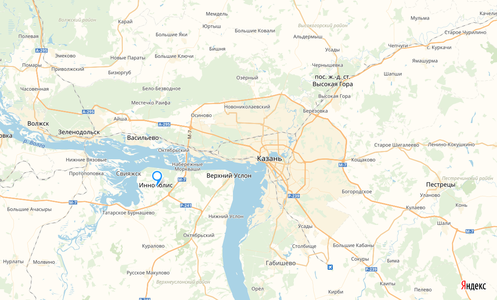
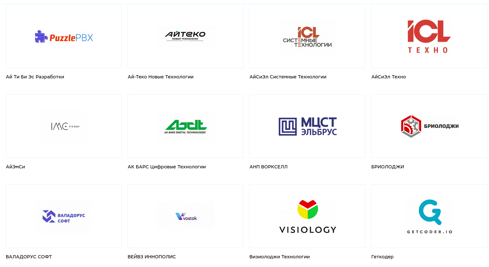
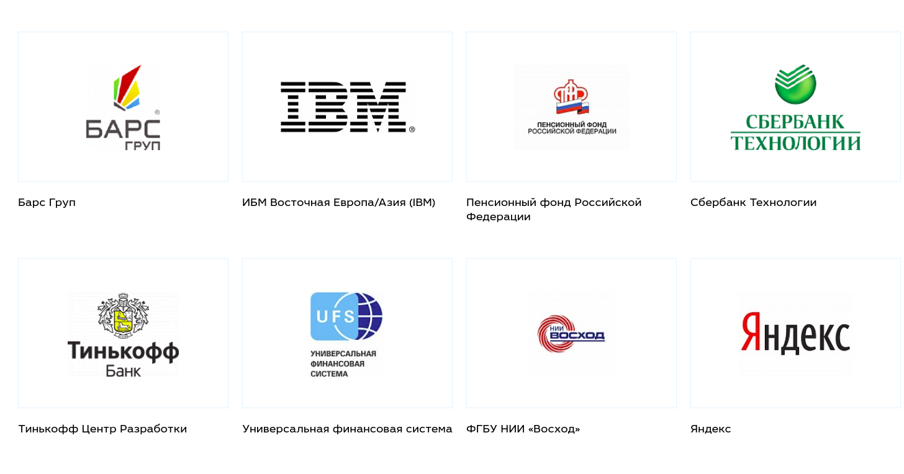

----?image=assets/image/tp.jpg&position=center
# Иннополис

Рай для программистов?

---
## История
- Идея ~ 2010
- Базовая инфраструктура 2012-2015
- Статус города - июнь 2015
- Население на 2018 г ~ 2500 человек
---
### Расположение

---
## Инфраструктура

- Университет, лицей, школа, детский сад
- Спорткомплекс, медцентр(терапевт 24/7), педиатр
- Жилые дома (840 кв) + 730 кв строятся(заселение 08.2018)

---

### Бытовая инфраструктура

- 2 супермаркета (Бахетле, Пятерочка)
- Почта, банки (Сбербанк, Акбарс) |
- Аптека, дом быта, книжный, салон красоты, цветы |
- Прокат велосипедов/сноубордов |
- Пиццерия, бар, кальянная, столовые |
- Фермерская ярмарка по средам |
---

### Бытовая инфраструктура
- Ростелеком, Таттелеком; большая 4ка + Летай
- Хостел, коворкинг|
- Горнолыжный склон, гольфовое поле, стендовая стрельба|
- Нотариус|
- Автомойка, шиномонтаж|
---

---
### Университет
 
- Обучают Software Engineering, BigData, Robotics
- Бакалавриат + магистратура
- Нет бюджета, стоимость > 1 млн, есть гранты

---
### Центр IT‑подготовки
 
- Очные курсы ~ 2.5 месяца
- Несколько ЯП, но в основном Java
- Проживание в кампусе, 3-х разовое питание
- Можно обучаться бесплатно
- [Детальная информация по курсам](https://apply.innopolis.ru/stc/)
---
#### Резиденты

---
#### Партнеры

---
### Вакансии
 
- [Вакансии t.me/innopolis_job](https://t.me/innopolis_job)
- ФГБУ НИИ «Восход» приглашает в свою команду Senior/Middle Java Developer |
- В компании МТС в г.Иннополис открыта вакансия UX/UI дизайнера |
---
### Культурная жизнь
 
- Концерты
- Конкурсы
- Показы фильмов
- Городские мероприятия
---
### События
 
- [29 апреля Иннополумарафон 🏅 ](https://timerman.org/)
- [6-8 июня, ЦИПР, промокод CFREE102](https://reg.cipr.ru/)
---
### Pros and cons
 
 Плюсы
  
- Экология
- Мало народа
- Дешевая аренда
---
### Pros and cons
 
Минусы
 
- Ветер
- Недостаточно инфраструктуры
- Меньше рынок труда (по сравнению с Москвой)

---

---
### Вопросы?

 

@fa[telegram gp-contact](Telegram @niksergey)
